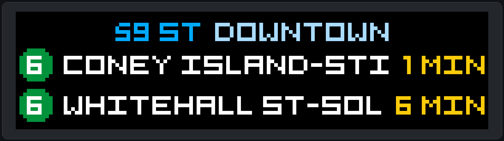

# MTA LED Arrival Board



A configurable NYC subway arrival board with a pixel-accurate browser preview and an optional 128×32 HUB75 LED matrix output.

The layout shows the station name and next two trains using a crisp 5×7 LED font, official route colors, destinations, and countdowns. Live MTA subway data does not require an API key.

The included configuration tracks Manhattan-bound N/W trains at Broadway in Astoria:

- Station: `R05` (Broadway)
- Direction: `S` (southbound/Manhattan-bound)
- Realtime feed: MTA `gtfs-nqrw`

## Run the virtual board

Python 3.11 or newer is required.

```sh
python3 -m venv .venv
source .venv/bin/activate
python -m pip install -e .
mta-board preview
```

The preview opens at <http://127.0.0.1:8000>. It downloads the official static MTA subway GTFS data on first use, caches station names in `~/.cache/mta-board`, and polls realtime data every 30 seconds.

## CLI reference

| Command | Purpose | Example |
| --- | --- | --- |
| `stations` | Search stations by name, ID, borough, route, or direction | `mta-board stations "59 lex 6"` |
| `lines` | Search routes and their MTA corridors | `mta-board lines Lexington` |
| `configure` | Show or persist the default station, routes, and direction | `mta-board configure --station 629 --routes 6 --direction S` |
| `preview` | Run the live browser preview; flags are temporary overrides | `mta-board preview --station R09 --routes N,W --direction S` |
| `snapshot` | Save one 128×32 PNG frame | `mta-board snapshot --demo --output preview.png` |
| `run` | Drive the physical HUB75 matrix | `sudo mta-board run --renderer matrix` |

Run `mta-board COMMAND --help` for all options. Commands use `config.toml` by default; pass `--config PATH` to `configure`, `preview`, `snapshot`, or `run` to use another file.

To test without network access:

```sh
mta-board preview --demo
```

To create one raw 128×32 frame:

```sh
mta-board snapshot --demo --output preview.png
```

## Configure it

Show the saved setup or update it using a station ID or unique search:

```sh
mta-board configure
mta-board configure --station "broadway astoria" --routes N,W --direction S
```

This writes `config.toml`. You can also edit it directly; station IDs must omit the direction suffix:

```toml
[board]
station_id = "R05"
routes = ["N", "W"]
direction = "S"
minimum_lead_minutes = 0
max_arrivals = 2
```

Settings can be temporarily overridden without editing the file:

```sh
mta-board preview --station R05 --routes N,W --direction S --minimum-lead 5
```

### Find a station

The bundled catalog includes all 496 MTA subway and Staten Island Railway station records. Search by station name, borough, line, route, direction label, or ID:

```sh
mta-board stations broadway
mta-board stations "broadway astoria"
mta-board stations queens N
mta-board stations 6
mta-board lines N
mta-board lines Lexington
```

Results show the GTFS ID, routes, and rider-facing meaning of each direction. A unique search can also be used directly:

```sh
mta-board preview --station "broadway astoria" --routes N,W --direction S
```

Ambiguous searches stop and print matching IDs rather than silently selecting the wrong station. The bundled catalog can be refreshed from the official NY Open Data dataset with:

```sh
python scripts/update_station_catalog.py
```

`N` and `S` are internal GTFS direction codes, not necessarily geographic north and south. Search results show rider-facing labels such as Uptown, Downtown, Queens, Manhattan, or Westbound.

MTA subway stop IDs and route metadata come from the [official static GTFS feed](https://www.mta.info/developers). The application automatically selects the appropriate realtime feed for the configured routes.

## Run the physical board

The intended hardware is an original Pi Zero W, an Adafruit RGB Matrix Bonnet, and two horizontally chained 64×32 HUB75 panels. Use Raspberry Pi OS Lite 32-bit based on Bookworm or newer.

First verify the matrix using the upstream examples. Then install the Python bindings and this project:

```sh
sudo apt update
sudo apt install -y git build-essential python3-dev python3-venv python3-pil cython3
git clone https://github.com/hzeller/rpi-rgb-led-matrix.git
cd rpi-rgb-led-matrix
make build-python PYTHON=$(command -v python3)
sudo make install-python PYTHON=$(command -v python3)
cd /opt/mta-board
python3 -m venv --system-site-packages .venv
.venv/bin/python -m pip install -e .
sudo .venv/bin/mta-board run --renderer matrix --config config.toml
```

The physical driver uses:

- 32 panel rows
- 64 panel columns
- Chain length 2
- `adafruit-hat` GPIO mapping
- 25% initial brightness
- GPIO slowdown 0 for the original Pi Zero W

If the panel shows corruption, change `gpio_slowdown` in `config.toml` one step at a time. Do not increase brightness until the display is stable and adequately powered.

### Start at boot

After installing the project at `/opt/mta-board`:

```sh
sudo cp deploy/mta-board.service /etc/systemd/system/
sudo systemctl daemon-reload
sudo systemctl enable --now mta-board
```

Inspect logs with:

```sh
sudo journalctl -u mta-board -f
```

To change a deployed board, SSH into the Pi, update its saved configuration, and restart the service:

```sh
sudo /opt/mta-board/.venv/bin/mta-board configure \
  --config /opt/mta-board/config.toml \
  --station "broadway astoria" --routes N,W --direction S
sudo systemctl restart mta-board
```

The matrix driver requires elevated GPIO access; its upstream runtime initializes the hardware and then drops privileges where supported.

## Tests

```sh
python -m unittest discover -s tests -v
```

The tests use generated GTFS-Realtime fixtures and do not require network access.
