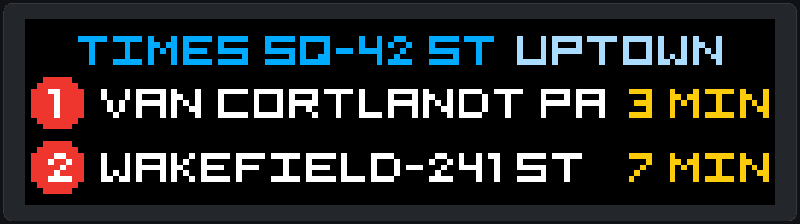

# MTA LED Arrival Board

[](https://github.com/gerin98/mta-board/actions/workflows/ci.yml)



A configurable NYC subway arrival board with a pixel-accurate browser preview and an optional 128×32 HUB75 LED matrix output.

The layout shows the station name and next two trains using Adam Bjornson's monospaced Pixel Five font, official route colors, destinations, and countdowns. Live MTA subway data does not require an API key.

The station, routes, travel direction, arrival cutoff, brightness, and scrolling behavior are all configurable. The application selects the appropriate MTA realtime feed automatically.

## Run the virtual board

Python 3.11 or newer is required.

```sh
python3 -m venv .venv
source .venv/bin/activate
python -m pip install -e .
mta-board preview
```

The preview opens at <http://127.0.0.1:8000>. See the [CLI guide](cli/README.md) for station lookup, configuration, snapshots, feed checks, demo mode, and the complete command reference.

## Run the physical board

The intended hardware is an original Pi Zero W, an Adafruit RGB Matrix Bonnet, and two horizontally chained 64×32 HUB75 panels. Use Raspberry Pi OS Lite 32-bit based on Bookworm or newer.

### Prepare the Raspberry Pi

1. Use [Raspberry Pi Imager](https://www.raspberrypi.com/software/) to write Raspberry Pi OS Lite (32-bit) to the microSD card.
2. In Imager's OS customization screen, set a hostname, username, password, and Wi-Fi network, then enable SSH. A hostname such as `mta-board` makes the Pi easy to find.
3. Insert the card, start the Pi, allow a minute or two for its first boot, and connect from another computer:

   ```sh
   ssh YOUR_USERNAME@mta-board.local
   ```

   Replace `YOUR_USERNAME` with the username selected in Imager. If the hostname does not resolve, use the Pi's IP address instead of `mta-board.local`.

4. On the Pi, install Git, download this repository, and run the installer:

   ```sh
   sudo apt update
   sudo apt install -y git
   git clone https://github.com/gerin98/mta-board.git
   cd mta-board
   sudo ./scripts/install_pi.sh
   ```

The installer adds the OS dependencies, deploys the project to `/opt/mta-board`, builds a pinned version of the upstream matrix driver, installs the systemd service, and starts the board. It preserves an existing `/opt/mta-board/config.toml`, so it is safe to run again when updating the software.

Use `sudo ./scripts/install_pi.sh --no-start` when preparing the Pi before the panels are connected. Use `./scripts/install_pi.sh --dry-run` to print every planned command without changing the system.

After installation, confirm that the service is running:

```sh
sudo systemctl status --no-pager mta-board
```

The physical driver uses:

- 32 panel rows
- 64 panel columns
- Chain length 2
- `adafruit-hat` GPIO mapping
- 25% initial brightness
- GPIO slowdown 0 for the original Pi Zero W

If the panel shows corruption, change `gpio_slowdown` in `config.toml` one step at a time. Do not increase brightness until the display is stable and adequately powered.

### Service and logs

The installer enables the board service at boot automatically.

Inspect logs with:

```sh
sudo journalctl -u mta-board -f
```

To change a deployed board, SSH into the Pi, update its saved configuration, and restart the service:

```sh
sudo /opt/mta-board/.venv/bin/mta-board configure \
  --config /opt/mta-board/config.toml \
  --station 127 --routes 1,2,3 --direction N
sudo systemctl restart mta-board
```

To install a later version, update the checkout and rerun the same installer:

```sh
cd ~/mta-board
git pull
sudo ./scripts/install_pi.sh
```

The matrix driver requires elevated GPIO access; its upstream runtime initializes the hardware and then drops privileges where supported.

## Tests

```sh
python -m unittest discover -s tests -v
```

The tests use generated GTFS-Realtime fixtures and do not require network access.
